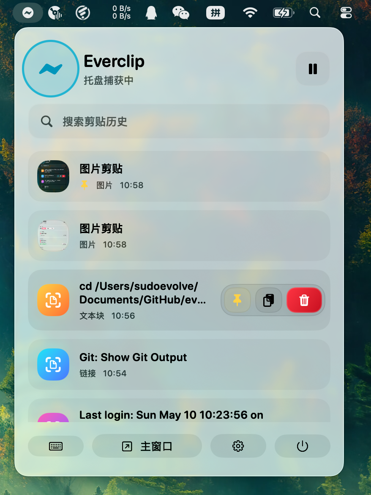
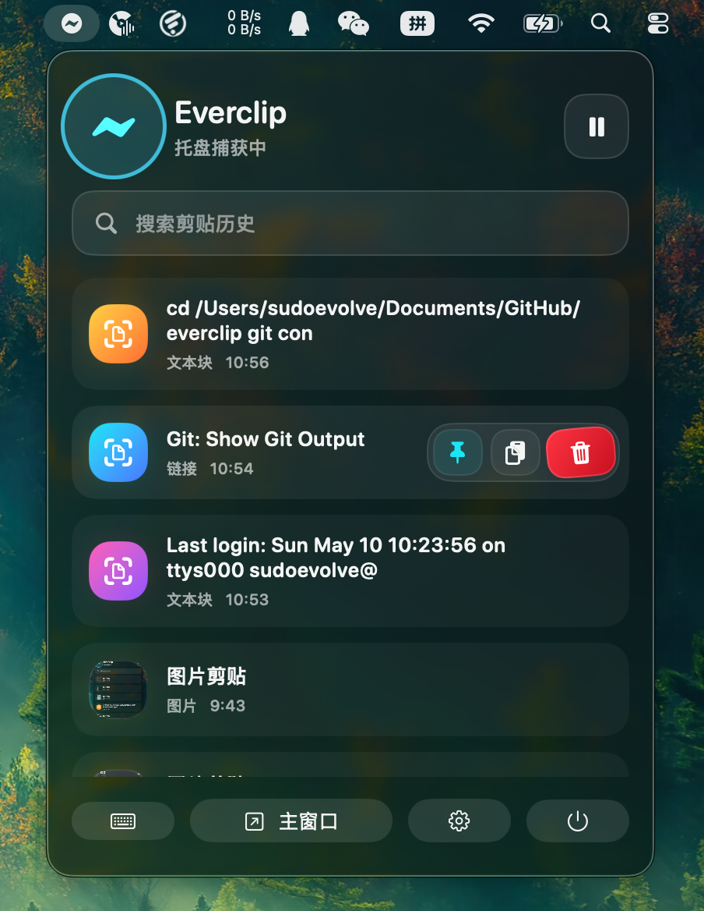

# Everclip

Everclip 是一个为 macOS 设计的菜单栏剪贴板工具。它把剪贴板历史、图片预览、快速搜索和输入处快捷粘贴收进一个轻量浮窗里，适合反复复制代码、链接、截图和常用文本的人。

它不是一个大而重的资料库，而是一个贴近输入场景的快速粘贴层：常驻菜单栏，需要时用快捷键唤出，选中后直接复制或粘贴。

## 预览

<p align="center">
  
  
</p>

## 亮点

- 菜单栏常驻运行，不占用 Dock 空间
- 自动捕获文本、链接、代码片段、截图和图片
- 图片缩略图预览，支持再次复制和粘贴
- `Command + Shift + V` 打开快速粘贴浮窗
- 搜索剪贴历史，用 `↑` / `↓` 上下选择，按 `Return` 直接粘贴
- 支持键盘多选：`Shift + ↑` / `Shift + ↓` 扩展选择，`Command + A` 全选，回车批量粘贴
- 支持置顶收藏、单条删除、分组折叠和一键清空
- 悬停操作区：复制、置顶、删除不再藏在右键菜单里
- 日间、夜间、跟随系统外观
- 首次启动介绍和独立设置窗口
- 历史记录落盘保存，图片文件独立存储，降低偏大的 UserDefaults 写入风险

## 快捷键

| 操作 | 快捷键 |
| --- | --- |
| 打开快速粘贴浮窗 | `Command + Shift + V` |
| 在浮窗中移动选择 | `↑` / `↓` |
| 扩展多选范围 | `Shift + ↑` / `Shift + ↓` |
| 全选当前列表 | `Command + A` |
| 粘贴当前选择或已选多项 | `Return` |
| 关闭浮窗 | `Esc` |

多选时，浮窗底部会显示已选数量。若没有手动多选，`Return` 会粘贴当前高亮项；若已经选择多项，`Return` 会按列表顺序批量写入剪贴板并粘贴。

## 权限

Everclip 可以记录剪贴板历史。若要在选择后自动回填到当前输入框，需要授予 macOS 辅助功能权限。

手动授权路径：

```text
系统设置 -> 隐私与安全性 -> 辅助功能
```

然后添加并启用 Everclip。未授权时，Everclip 仍然可以复制选中的历史项，但自动粘贴可能需要你再按一次 `Command + V`。

## 运行与构建

使用 Xcode 打开 `everclip.xcodeproj`，选择 `everclip` scheme 后运行。

命令行构建：

```sh
DEVELOPER_DIR=/Applications/Xcode.app/Contents/Developer xcodebuild \
  -project everclip.xcodeproj \
  -scheme everclip \
  -destination platform=macOS \
  -derivedDataPath /private/tmp/everclip-derived \
  CODE_SIGNING_ALLOWED=NO \
  build
```


## about

sudoevolve

Email: sudoevolve@gmail.com
